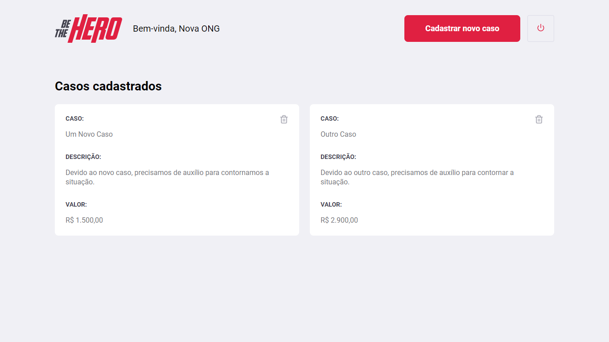

# Application developed in the 11th Omnistack Week

**Be The Hero** is an application that allows to manage ONGs and the incidents registered by them. The goal is to allow anyone to help them.

## Technologies used
 - express
 - <a href="http://knexjs.org/">knex</a>
 - sqlite3
 - expo
 - <a href="https://github.com/arb/celebrate">celebrate</a> and <a href="https://hapi.dev/module/joi/">Joi</a> (backend validations)
 - <a href="https://jestjs.io/docs/en/getting-started">jest</a> and supertest (integration and unit tests)

## Instructions for running the backend
- After cloning the repository, enter the *backend* folder and run the `yarn` command. It is a package manager that will download the project's dependencies.

- After downloading all the dependencies, still inside the *backend* folder, execute the command `yarn ml`. This command is a shortcut to `yarn knex migrate: latest`, which will perform the migrations responsible for creating the tables in the database.

- With the tables created, run `yarn start` to boot the server.

## Instructions for running the frontend
- After cloning the repository, enter the *frontend* folder and run the `yarn` command. It is a package manager that will download the project's dependencies.

- After downloading all the dependencies, run `yarn start` to boot the web application.

## Instructions for running mobile app
- Install the expo as a global dependency on the system. Run the command `npm install -g expo-cli`;

- You will also need to have the expo installed on your device (*you can find it at the Apple Store or Play Store*);

- After cloning the repository, enter the *mobile* folder and run the `yarn` command. It is a package manager that will download the project's dependencies.

- After downloading all the dependencies, run `yarn start` to boot the metro bundler application. Scan the qrcode generated with the expo application and wait for the application to load.

## Screens (WEB)
> Logon Page

> Register Page

> Profile Page (Incidents List)

> New Incident Page

## Screens (Mobile)
> Incidents List and Incident Detail Screens

  
    
  

